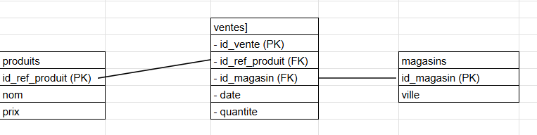

## 🧩 Modèle Conceptuel de Données (MCD)

**produits**
- id_ref_produit (PK)
- nom
- prix

**magasins**
- id_magasin (PK)
- ville

**ventes**
- id_vente (PK)
- date
- id_ref_produit (FK -> produits)
- id_magasin (FK -> magasins)
- quantite

****